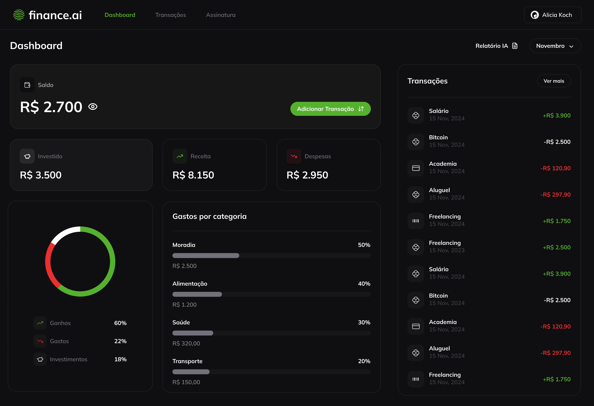
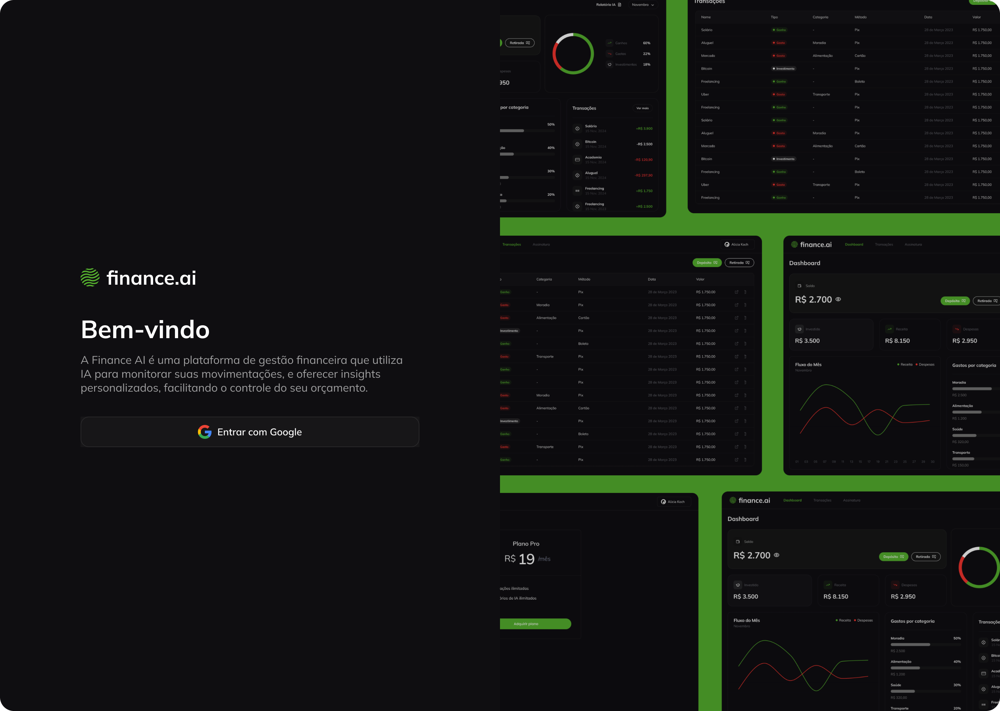

  SmartFinance
   
  <a href="#about"><strong>Explore the screenshots »</strong></a>
   
   
  <a href="https://github.com/LHenrique2502/smartfinance/issues/new?assignees=&labels=bug&template=01_BUG_REPORT.md&title=bug%3A+">Report a Bug</a>
  ·
  <a href="https://github.com/LHenrique2502/smartfinance/issues/new?assignees=&labels=enhancement&template=02_FEATURE_REQUEST.md&title=feat%3A+">Request a Feature</a>
  .
  <a href="https://github.com/LHenrique2502/smartfinance/issues/new?assignees=&labels=question&template=04_SUPPORT_QUESTION.md&title=support%3A+">Ask a Question</a>

 

---

## About

> **[?]**
> Provide general information about your project here.
> What problem does it (intend to) solve?
> What is the purpose of your project?
> Why did you undertake it?
> You don't have to answer all the questions -- just the ones relevant to your project.

Screenshots

 

> **[?]**
> Please provide your screenshots here.

|                               Home Page                                |                                Login Page                                |
| :--------------------------------------------------------------------: | :----------------------------------------------------------------------: |
|  |  |

### Built With

> **[?]**
> Please provide the technologies that are used in the project.

## Getting Started

### Prerequisites

> **[?]**
> What are the project requirements/dependencies?

### Installation

> **[?]**
> Describe how to install and get started with the project.

## Usage

> **[?]**
> How does one go about using it?
> Provide various use cases and code examples here.

## Roadmap

See the [open issues](https://github.com/LHenrique2502/smartfinance/issues) for a list of proposed features (and known issues).

- [Top Feature Requests](https://github.com/LHenrique2502/smartfinance/issues?q=label%3Aenhancement+is%3Aopen+sort%3Areactions-%2B1-desc) (Add your votes using the 👍 reaction)
- [Top Bugs](https://github.com/LHenrique2502/smartfinance/issues?q=is%3Aissue+is%3Aopen+label%3Abug+sort%3Areactions-%2B1-desc) (Add your votes using the 👍 reaction)
- [Newest Bugs](https://github.com/LHenrique2502/smartfinance/issues?q=is%3Aopen+is%3Aissue+label%3Abug)

## Support

> **[?]**
> Provide additional ways to contact the project maintainer/maintainers.

Reach out to the maintainer at one of the following places:

- [GitHub issues](https://github.com/LHenrique2502/smartfinance/issues/new?assignees=&labels=question&template=04_SUPPORT_QUESTION.md&title=support%3A+)
- Contact options listed on [this GitHub profile](https://github.com/LHenrique2502)

## Project assistance

If you want to say **thank you** or/and support active development of SmartFinance:

- Add a [GitHub Star](https://github.com/LHenrique2502/smartfinance) to the project.
- Tweet about the SmartFinance.
- Write interesting articles about the project on [Dev.to](https://dev.to/), [Medium](https://medium.com/) or your personal blog.

Together, we can make SmartFinance **better**!

## Contributing

Please read [our contribution guidelines](docs/CONTRIBUTING.md), and thank you for being involved!

## Authors & contributors

The original setup of this repository is by [Lucas Henrique de Souza Pereira](https://github.com/LHenrique2502).

For a full list of all authors and contributors, see [the contributors page](https://github.com/LHenrique2502/smartfinance/contributors).

## Security

SmartFinance follows good practices of security, but 100% security cannot be assured.
SmartFinance is provided **"as is"** without any **warranty**. Use at your own risk.

_For more information and to report security issues, please refer to our [security documentation](docs/SECURITY.md)._
